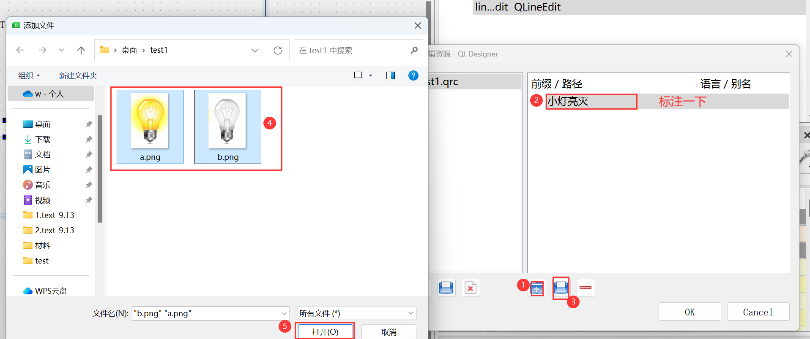
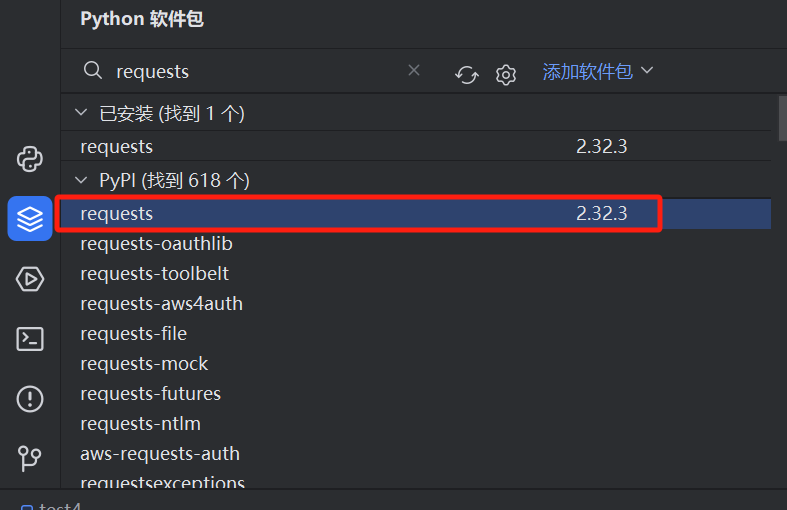

## 学会使用PyQt5

> pycharm 2024.2.1

> python 3.9.9

> python版本3.9或低于3.9

#### 1. **安装PyQt相关工具 **

使用pycharm软件：安装PyQt5和PyQt5-tools
使用pycharm软件：安装PyQt5和PyQt5-tools


#### 2. **PyCharm**配置PyQt5

打开设置->工具->外部工具->添加文件(点击加号)


1. 名称：QtDesigner

工具设置

  程序：D:\Studyspace\Python\reptile\venv\Scripts\pyqt5designer.exe

实参：  $FileDir$\$FileName$

  工作目录：$FileDir$


下面俩个如法炮制：

2. 名称：PyUIC

工具设置

  程序：取安装包中的pyuic5.exe程序

  实参：$FileName$ -o $FileNameWithoutExtension$.py -x

  工作目录：$FileDir$


3. 名称：Pyrcc

工具设置

  程序：取安装包中的pyrcc5.exe程序

  实参：$FileName$ -o $FileNameWithoutExtension$_rc.py

  工作目录：$FileDir$


完成后在pycharm的上面导航栏中，按照下图所示，即可打开PyQt5设计。


#### 3. **PyQt5设计界面介绍**

点击QtDesigner出现下面弹窗


出现下图


* **位于左上方的“Widget Box”包含了各种可以自由拖动的组件；**

* **位于界面中央的“MainWindows - untitled”就是你可以设计的画布；**

* **位于右上方的“对象查看器”可以查看当前ui的结构；**

* **位于右侧中央的“属性编辑器”可以设置选中组件的属性；**

* **位于右下方的“资源浏览器”可以添加各种素材，比如像图片、背景等等。**

#### 


#### 5. 任务：做一个矩形面积计算工具[^1]

[^1]:工程文档在test1

创建文件夹，并命名为text，使用pycharm打开

使用外部工具QtDesigner设计界面：

在左边的Wiget Box中找到“Push Button”、“Label”、“lineEdit”，通过双击即可修改名称，右边有属性可以修改。快捷键Ctrl+r，预览当前编写的GUI。


将“ .ui” 文件保存到text里，打开pycharm，右击.ui文件选择“外部工具”中的“PyUIC”工具将.ui文件转化为.py文件


当然如果你运行这个代码，它是没有任何的问题，想要看见这个ui界面，还需要添加其他的东西，这里新建一个文件：mytest.py

```python
import sys

from untitled import Ui_MainWindow

from PyQt5.QtWidgets import QApplication,QMainWindow
 
class mywindows(QMainWindow,Ui_MainWindow):

  def jisuan(self):

​    a=self.lineEdit.text()

​    b=self.lineEdit_2.text()
	  c=str( int(a)*int(b) )

​    self.lineEdit_3.setText(c)

  def __init__(self):

​    super(mywindows,self).__init__()

​    self.setupUi(self)

​		#连接信号与槽 connect代码

​    self.pushButton.clicked.connect(self.jisuan)

 

if __name__ == '__main__':

  # 实例化，传参

  app = QApplication(sys.argv) 

  # 创建对象

  mainWindow = mywindows() 

  # 创建窗口

  mainWindow.show()   

  # 进入程序的主循环，并通过exit函数确保主循环安全结束(该释放资源的一定要释放)

  sys.exit(app.exec_())
```

 当然它只能表示一个展示的功能，那么后续的其他功能添加，我们准备放在项目设计当中来完成

 ````python
 if __name__ == '__main__':
 
   # 实例化，传参
   app = QApplication(sys.argv) 
   # 创建对象
   mainWindow = QMainWindow() 
   # 创建ui，引用untitled文件中的Ui_MainWindow类
   ui = untitled.Ui_MainWindow()   
   # 调用Ui_MainWindow类的setupUi，创建初始组件
   ui.setupUi(mainWindow)   
   # 创建窗口
   mainWindow.show()   
   # 进入程序的主循环，并通过exit函数确保主循环安全结束(该释放资源的一定要释放)
 
   sys.exit(app.exec_())
 ````

## 做个UI界面吧！

#### 1. 任务1：做个开关灯的界面[^2]

[^2]:工程文档在test2

```python
	#关键代码：
self.label.show() #显示label图片（文字等）
self.label.hide() #不显示label图片（文字等）
```

新建文件夹，命名为test1，将俩张图片（开灯和关灯）放入该文件夹

打开外部工具QtDesigner将图片添加到资源库中

往界面添加图片





 然后添加一个亮小灯

如法炮制再添加一个没亮的小灯图片


往界面添加按键：


将界面文件保存到test1文件里


打开pycharm,

将.ui和.qrc转化为.py格式

 注：.ui使用pyuic转；.qrc使用pyrcc转


这里新建一个文件：main.py

 ````python
 import sys
 from test1 import Ui_Form
 from PyQt5.Qt import QApplication, QMainWindow,QTimer
 class mywindows(QMainWindow, Ui_Form):
     #复位
     def clear(self):
         self.label.hide()
         self.label_2.hide()
     #开灯
     def kaiden(self):
         self.clear()
         self.label.show()
     #关灯
     def guanden(self):
         self.clear()
         self.label_2.show()
     #初始化：
     def __init__(self):
         super(mywindows, self).__init__()
         self.setupUi(self)
         self.n=0
         # 连接信号与槽 connect代码
         self.pushButton.clicked.connect(self.kaiden)
         self.pushButton_2.clicked.connect(self.guanden)
         self.clear()
 if __name__ == '__main__':
     # 实例化，传参
     app = QApplication(sys.argv)
     # 创建对象
     mainWindow = mywindows()
     # 创建窗口
     mainWindow.show()
     # 进入程序的主循环，并通过exit函数确保主循环安全结束(该释放资源的一定要释放)
     sys.exit(app.exec_())
 
 
 ````

#### 2.任务2：做动画界面（定时器）[^3]

[^3]:工程文档在test2.0

````python
self.time1=QTimer()
self.time1.timeout.connect(self.*)   # *表示要循环的函数名
self.time1.start(1000)               # 定时器开始，1000mS间隔
self.time1.stop()

````

详细教程请看任务1

创建文件夹名为test2，将几张图片放入test并添加到QtDesigner的资源库中

然后将图片添加到界面当中，设置好图片大小并重合到一起，保存界面到test2

最后按任务1的操作将他们转换为.py文件

新建一个main.py文件:

````python
import sys
from test2 import Ui_Form

from PyQt5.Qt import QApplication, QMainWindow,QTimer
class mywindows(QMainWindow, Ui_Form):
    def clear(self):
        self.label.hide()
        self.label_2.hide()
        self.label_3.hide()
        self.label_4.hide()
        self.label_5.hide()
    def chuli(self):
        sw = self.n%5
        if sw == 0:
            self.clear()
            self.label.show()
        elif sw == 1:
            self.clear()
            self.label_2.show()
        elif sw == 2:
            self.clear()
            self.label_3.show()
        elif sw == 3:
            self.clear()
            self.label_4.show()
        elif sw == 4:
            self.clear()
            self.label_5.show()
        self.n += 1
    def __init__(self):
        super(mywindows, self).__init__()
        self.setupUi(self)
        self.n=0
        self.clear()
        self.time1 = QTimer()
        self.time1.timeout.connect(self.chuli)
        self.time1.start(200)
if __name__ == '__main__':
    # 实例化，传参
    app = QApplication(sys.argv)
    # 创建对象
    mainWindow = mywindows()
    # 创建窗口
    mainWindow.show()
    # 进入程序的主循环，并通过exit函数确保主循环安全结束(该释放资源的一定要释放)
    sys.exit(app.exec_())
````


## 做一个猜拳游戏吧[^4]

[^4]:工程文档在test3

创建test3文件夹将图片资源放入其中打开外部工具设计界面

##### 1. 创建UI页面

新建图片资源库（详细请看上面俩工程介绍）


注意：

* 点击ctrl+r预览页面发现框内可以随机输入，想要更改成只读状态则执行下图操作


* 如何添加可以选择的Buttons


* 注意更改要用到的变量名：


将文件保存并转化成.py文件

##### 2. 编写代码

基本框架：

````py
import sys
from test3 import Ui_Dialog
from PyQt5.Qt import QApplication,QMainWindow,QTimer

class mywindows(QMainWindow, Ui_Dialog):
    def __init__(self):
        super().__init__()
        self.setupUi(self)
         
 if __name__ == '__main__':
    app = QApplication(sys.argv)#建立一个app对象
    my = mywindows()            #建立一个my对象
    my.show()
    sys.exit(app.exec_())
````


1> 用定时器实现机器随机出拳

2> 将me选项和图片绑定

3> 建一个字典来算出他们的得分情况

4> 点击一次对战计算一次分数，用累加计算jq得分和me的得分

5> 绑定对战和剩余数

````python 
'''
猜拳游戏：
    规则：对局10局，每胜一局得3分，平一局得1分，输一局不加分。

'''

import sys,time
from test3 import Ui_Dialog
from PyQt5.Qt import QApplication,QMainWindow,QTimer

#字典：根据双方各出现的结果来判断双方的得分情况
jieguo={
        "0 0":[1,1], "0 1":[3,0], "0 2":[0,3],
        "1 0":[0,3], "1 1":[1,1], "1 2":[3,0],
        "2 0":[3,0], "2 1":[0,3], "2 2":[1,1]

}

#玩家类：俩属性，一方法
class wanjia:
    def __init__(self):
        self.chuquan = 0
        self.fenzhi = 0
    def jiafen(self,value):
        self.fenzhi = self.fenzhi  + value

class mywin(QMainWindow, Ui_Dialog):

    #入口
    def __init__(self):
        super().__init__()
        self.setupUi(self)

        self.n = 0  #机器人切换石头剪刀布定义的变量
        self.i = 10 #定义剩余的次数的变量

        # 清除输赢框
        self.jq_00.clear()
        self.me_00.clear()

        self.timer = QTimer()   # 创建一个QTimer实例，用于定时任务
        self.timer.timeout.connect(self.qiehuan)  # 将定时器的timeout信号连接到qiehuan槽函数，以便在定时器超时时执行
        self.timer.setInterval(50)  # 设置定时器的间隔时间为50毫秒
        self.timer.start()  # 启动定时器

        self.xz_1.clicked.connect(self.xuanze)
        self.xz_2.clicked.connect(self.xuanze)
        self.xz_3.clicked.connect(self.xuanze)
        self.clear2()
        self.me_1.show()
        self.xz_1.setChecked(True)
        self.pushButton.clicked.connect(self.pancai)

        self.jqr=wanjia()
        self.me=wanjia()

        self.sy.setText(str(self.i))


    def clear1(self):
        self.jq_1.hide()
        self.jq_2.hide()
        self.jq_3.hide()

    def clear2(self):
        self.me_1.hide()
        self.me_2.hide()
        self.me_3.hide()

    def qiehuan(self):
        self.clear1()
        sw = self.n % 3
        if sw == 0:
            self.jq_1.show()
            self.jqr.chuquan=0
        elif sw == 1:
            self.jq_2.show()
            self.jqr.chuquan=1
        elif sw == 2:
            self.jq_3.show()
            self.jqr.chuquan=2

        self.n+=1

    def xuanze(self):
        self.clear2()
        myclick = self.sender()
        if myclick == self.xz_1:
            self.me_1.show()    #点击“石头”，me对应的图片出现
            self.me.chuquan=0   #点击“石头”，将他
        elif myclick == self.xz_2:
            self.me_2.show()
            self.me.chuquan=1
        elif myclick == self.xz_3:
            self.me_3.show()
            self.me.chuquan=2

    def pancai(self):


        self.timer.stop()
        print(self.jqr.chuquan,self.me.chuquan)#机器人和me，出拳
        ls = str(self.jqr.chuquan)+' '+str(self.me.chuquan)#把“出拳”转成字符串
        jg=jieguo[ls]           #根据对局出拳，查出得分
        print(jg[0],jg[1])
        self.jqr.jiafen(jg[0])
        self.me.jiafen(jg[1])
        self.jq_df.setText(str(self.jqr.fenzhi))
        self.me_df.setText(str(self.me.fenzhi))

        if jg[0]>jg[1]:
            self.jq_00.setText("赢")
            self.me_00.setText("输")
        elif jg[0]<jg[1]:
            self.me_00.setText("赢")
            self.jq_00.setText("输")
        else:
            self.me_00.setText("平")
            self.jq_00.setText("平")
        QApplication.processEvents()    #刷新页面

        time.sleep(0.5)
        self.i -= 1
        self.sy.setText(str(self.i))
        self.timer.start()

if __name__ == '__main__':
    app = QApplication(sys.argv)#建立一个app对象
    my = mywin()            #建立一个my对象
    my.show()
    sys.exit(app.exec_())
````


## 做个爬虫吧——查询城市天气情况[^5]

[^5]:工程文档在test4

准备工作：

1. 城市天气情况查询 http://t.weather.itboy.net/api/weather/city/  +城市编码

​	如北京天气情况：http://t.weather.itboy.net/api/weather/city/101010100

2. 各个城市的编码：http://img.weather.com.cn/newwebgis/fc/nation_fc24h_wea_2024092020.json

3. 安装Requests库



##### 1. 界面设计


注意：

* 选择城市的框是combo box


* 城市天气情况表格显示是table view


保存并转.py文件

##### 2. 代码设计

````python
import requests,json
import sys
from test4 import Ui_Form
from PyQt5.Qt import  QApplication,QMainWindow,QTableView
from PyQt5 import QtCore,QtGui

class mywindows(QMainWindow,Ui_Form):
    def tianqi_cx(self):
        cityname=self.comboBox.currentText()    #城市名称选择(将字典中的城市绑定到槽中)
        #print(cityname)
        #print(self.city_no[cityname])
         
        url2 = 'http://t.weather.itboy.net/api/weather/city/%s'%(self.city_no[cityname])
        resp2 = requests.get(url2)
        resp2.encoding = 'utf-8'  # 汉字编码
        #print(resp2.text)
         
        res_json2 = resp2.json()
        print(res_json2['data']['forecast'])
        res_data2 =res_json2['data']['forecast']
      
      
        i=0
        for itme in res_data2:
            #print(itme)
            #print(itme['high'],itme['low'],itme['ymd'])

            #列表信息：
            self.qm.setItem(i, 0, QtGui.QStandardItem(itme['high']))
            self.qm.setItem(i, 1, QtGui.QStandardItem(itme['low']))
            self.qm.setItem(i, 2, QtGui.QStandardItem(itme['ymd']))
            self.qm.setItem(i, 3, QtGui.QStandardItem(itme['fx']))
            i+=1

    def city_code(self):
        url1 = 'http://img.weather.com.cn/newwebgis/fc/nation_fc24h_wea_2024092020.json'
        resp1 = requests.get(url1)
        resp1.encoding='utf-8'#汉字编码

        #print(resp1)
        #print(resp1.text)

        # 删除.json文件中开头的 webgisDot( 和结尾的 )
        res = resp1.text.replace('webgisDot(','').replace(')','')
        #print(res)
        res_json = json.loads(res)  #转成.json文件
        #print(res_json)
        res_data = res_json['data'] #保留data列表
        #print(res_data)

        # 字典：城市对应编码
        self.city_no={}
        for item in res_data:
            #print(item['namecn'],item['n'])    #提取城市名和编码
            self.comboBox.addItem(  item['namecn'])
            self.city_no[item['namecn']] = item['n']    #城市对应编码
        #print(self.city_no)


    def __init__(self):
        super().__init__()
        self.setupUi(self)

        #准备数据模型
        self.qm = QtGui.QStandardItemModel()

        #设置数据头栏名称
        self.qm.setHorizontalHeaderItem(0,QtGui.QStandardItem('日期'))
        self.qm.setHorizontalHeaderItem(1, QtGui.QStandardItem('高温'))
        self.qm.setHorizontalHeaderItem(2, QtGui.QStandardItem('低温'))
        self.qm.setHorizontalHeaderItem(3, QtGui.QStandardItem('天气情况'))

        #按照编号排序     #DescendingOrder(降序)    AscendingOrder(升序)
        self.qm.sort(0,QtCore.Qt.AscendingOrder)

        #将数据模型绑定到QTableView
        self.tableView.setModel(self.qm)

        self.city_code()
        self.pushButton.clicked.connect(self.tianqi_cx)

        self.tableView.setModel(self.qm)

if __name__ == "__main__":
    app = QApplication(sys.argv)
    my = mywindows()
    my.show()
    sys.exit(app.exec_())
````


## 做个爬虫吧——12306查询车票

准备工作：


谷歌浏览器请求头：

'Cookie': 'JSESSIONID=9966BD9775C5622560DD11602BFF7DC0; guidesStatus=off; highContrastMode=defaltMode; cursorStatus=off; route=6f50b51faa11b987e576cdb301e545c4; BIGipServerotn=787481098.50210.0000; BIGipServerpool_passport=48497162.50215.0000',
'Host': 'kyfw.12306.cn',
'Sec-Ch-Ua':'"Not A(Brand";v="99", "Google Chrome";v="121", "Chromium";v="121"',
'Sec-Ch-Ua-Mobile': '?0',
'Sec-Ch-Ua-Platform': '"Windows"',
'Sec-Fetch-Dest': 'document',
'Sec-Fetch-Mode': 'navigate',
'Sec-Fetch-Site': 'none',
'Sec-Fetch-User': '?1',
'Upgrade-Insecure-Requests': '1',
'User-Agent': 'Mozilla/5.0 (Windows NT 10.0; Win64; x64) AppleWebKit/537.36 (KHTML, like Gecko) Chrome/121.0.0.0 Safari/537.36'

##### 1. 界面设计


注意：

* 为了方便输入日期，这里使用Date Edit工具


 

 ##### 2. 代码设计

````python
import re
from turtledemo.penrose import start
import requests,json,datetime
from PyQt5 import QtGui,QtCore

import sys
from urllib3.util.util import to_str
from test5 import Ui_MainWindow
from PyQt5.Qt import QApplication,QMainWindow,QTableView

class myWindows(QMainWindow,Ui_MainWindow):
    #第二步
    def chezhan_info(self):
        url1 = 'https://kyfw.12306.cn/otn/resources/js/framework/station_name.js?station_version=1.9151'
        resp1 = requests.get(url1)
        resp1.encoding = 'utf8'
        #print(resp1.text)   #拼音缩写|站名称|站代码|全拼|站首写字母|站顺序号

        #检查请求状态
        if resp1.status_code == 200:

            #用正则表达式匹配数据（只要一部分）  \u表示以Unicode的编码格式    u4e00-u9fa5代表了符合汉字GB18030规范的字符集
            #正则提取字符串中的中文+‘|’+大写字母，+表示多个
            stations = re.findall('([\u4e00-\u9fa5]+)\|([A-Z]+)',resp1.text)
            #print(stations)
            #转成字典型
            self.stations_data = dict(stations)
            #print(self.stations_data)

            self.station_d = {}     #key与value进行互换
            for item in self.stations_data: #遍历每对键对应的键
                #print(item)
                self.station_d[self.stations_data[item]] = item   #根据键得到值，作为新字典的键；键为新字典的值
                self.comboBox1.addItem(item)    #车站信息存入下拉框
                self.comboBox2.addItem(item)
            print(self.stations_data)

        else:
            print('获取车站信息失败',resp1.status_code)
    #第三步车票查询
    def chepiao_cx(self):
        from_st = self.comboBox1.currentText()
        city_s = self.stations_data[from_st]        # 出发站
        to_st = self.comboBox2.currentText()
        city_e = self.stations_data[to_st]          # 到达站
        start_date = self.dateEdit.date().toString('yyyy-MM-dd')  # 时间   将/换成 -
        if self.radioButton1.isChecked():
            type = 'ADULT'
        elif self.radioButton2.isChecked():
            type = '0x00'
        #print(self.stations_data[from_st],self.stations_data[to_st],star_date,type)

        url2 = 'https://kyfw.12306.cn/otn/leftTicket/queryG?leftTicketDTO.train_date=%s&leftTicketDTO.from_station=%s&leftTicketDTO.to_station=%s&purpose_codes=%s'%(start_date,city_s,city_e,type)
        resp2 = requests.get(url2,headers=self.head)
        resp2.encoding = 'utf8'
        #print(resp2.text)


        data_json = resp2.json()#转换为json文件
        data_list = data_json['data']['result']
        #print(data_list)


        i=0
        for item in data_list:
            print(item)

            dt=item.split('|')

            #print(dt)
            print(dt[3],dt[6],dt[7],dt[30],dt[31],dt[32])
            self.qm.setItem(i,0,QtGui.QStandardItem(dt[3]))
            self.qm.setItem(i,1, QtGui.QStandardItem(dt[6]))
            self.qm.setItem(i,2, QtGui.QStandardItem(dt[7]))
            self.qm.setItem(i,3, QtGui.QStandardItem(dt[30]))
            self.qm.setItem(i,4, QtGui.QStandardItem(dt[31]))
            self.qm.setItem(i,5, QtGui.QStandardItem(dt[32]))
            i+=1

    def __init__(self):
        super().__init__()
        self.setupUi(self)

        #第一步做表头
        self.qm = QtGui.QStandardItemModel()
        self.qm.setHorizontalHeaderItem(0,QtGui.QStandardItem('车次'))
        self.qm.setHorizontalHeaderItem(1, QtGui.QStandardItem('上车站'))
        self.qm.setHorizontalHeaderItem(2, QtGui.QStandardItem('下车站'))
        self.qm.setHorizontalHeaderItem(3, QtGui.QStandardItem('一等座'))
        self.qm.setHorizontalHeaderItem(4, QtGui.QStandardItem('二等座'))
        self.qm.setHorizontalHeaderItem(5, QtGui.QStandardItem('商务座'))
        self.tableView.setModel(self.qm)
        
        self.dateEdit.setDate(datetime.date.today())#取当前日期到出发日期
        self.radioButton1.setChecked(True)#默认的是普通票

        self.chezhan_info()
        self.pushButton.clicked.connect(self.chepiao_cx)
        
        #谷歌浏览器请求头
        self.head={   'Cookie':'JSESSIONID=9966BD9775C5622560DD11602BFF7DC0; guidesStatus=off; highContrastMode=defaltMode; cursorStatus=off; route=6f50b51faa11b987e576cdb301e545c4; BIGipServerotn=787481098.50210.0000; BIGipServerpool_passport=48497162.50215.0000',
                      'Host':'kyfw.12306.cn',
                      'Sec-Ch-Ua':'"Not A(Brand";v="99", "Google Chrome";v="121", "Chromium";v="121"',
                      'Sec-Ch-Ua-Mobile':'?0',
                      'Sec-Ch-Ua-Platform':'"Windows"',
                      'Sec-Fetch-Dest':'document',
                      'Sec-Fetch-Mode':'navigate',
                      'Sec-Fetch-Site':'none',
                      'Sec-Fetch-User': '?1',
                      'Upgrade-Insecure-Requests': '1',
                      'User-Agent': 'Mozilla/5.0 (Windows NT 10.0; Win64; x64) AppleWebKit/537.36 (KHTML, like Gecko) Chrome/121.0.0.0 Safari/537.36'
                  }
        


if __name__ == "__main__":
    app = QApplication(sys.argv)
    my = myWindows()
    my.show()
    sys.exit(app.exec_())
````

我是dev分支的内容


 

