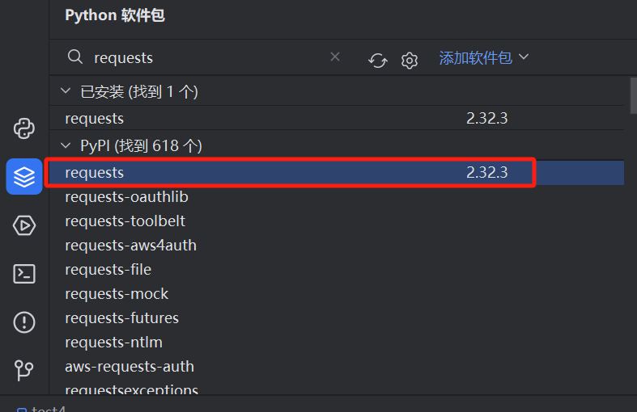
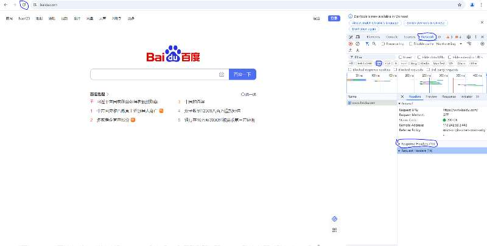

## 爬虫基础

##### Requests库介绍：

作用：简化HTTP发送请求和接收请求

安装库



网页开发者模式：F12

> requests.get()     用于发送GET请求 	获取网页或其他资源

> requests.post()   用于发送post请求	提交表格	

JSON数据交换

{

“name”：“黎明”，

“age”：30，

}

http://t.weather.itboy.net/api/weather/city/101010100


网站：https://www.12306.cn


上车站和下车站，出发站和到达站，时间 ，二等座，卧铺，


https://kyfw.12306.cn/otn/resources/js/framework/station_name.js?station_version=1.9151

https://kyfw.12306.cn/otn/leftTicket/queryG?leftTicketDTO.train_date=%s&amp;leftTicketDTO.from_station=%s&amp;leftTicketDTO.to_station=%s&amp;purpose_codes=%s'%(begin_date,citycode_start,citycode_end,purpose_codes)

​										时间		出发站   	到达站		类型


浏览器头文件查询：



```谷歌浏览器请求头
'Cookie': 'JSESSIONID=9966BD9775C5622560DD11602BFF7DC0; guidesStatus=off; highContrastMode=defaltMode; cursorStatus=off; route=6f50b51faa11b987e576cdb301e545c4; BIGipServerotn=787481098.50210.0000; BIGipServerpool_passport=48497162.50215.0000',
'Host': 'kyfw.12306.cn',
'Sec-Ch-Ua':'"Not A(Brand";v="99", "Google Chrome";v="121", "Chromium";v="121"',
'Sec-Ch-Ua-Mobile': '?0',
'Sec-Ch-Ua-Platform': '"Windows"',
'Sec-Fetch-Dest': 'document',
'Sec-Fetch-Mode': 'navigate',
'Sec-Fetch-Site': 'none',
'Sec-Fetch-User': '?1',
'Upgrade-Insecure-Requests': '1',
'User-Agent': 'Mozilla/5.0 (Windows NT 10.0; Win64; x64) AppleWebKit/537.36 (KHTML, like Gecko) Chrome/121.0.0.0 Safari/537.36'
```


